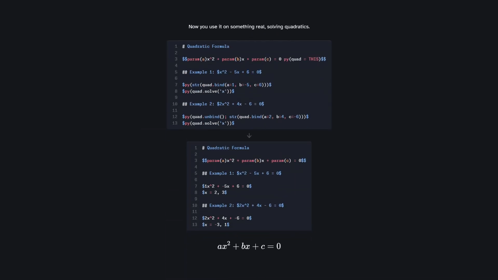

# Markdown Math Solver

A command-line tool that **processes Python code embedded in LaTeX math blocks** in Markdown files. Define expressions, bind parameters, evaluate math, and generate computed results.

## Demo

[](https://youtu.be/X-ZKafMsgVU)
[Watch the demo](https://youtu.be/X-ZKafMsgVU)

## Installation

```bash
pip install markdown-math-solver
```

## Quick Start

### 1. Create a Markdown file with embedded `py()` blocks

```markdown
# My Math Document

$5 + 3 py(mySum = THIS)$

Result: $py(ReplaceThis(mySum()))$
```

### 2. Run the tool

```bash
markdown-math-solver yourfile.md
```

### 3. Check output

Your results will be in `yourfile.output.md`:

```markdown
# My Math Document

$5 + 3$

Result: $8$
```

## Usage

```
markdown-math-solver [-h] [-o OUTPUT] [-v] file
```

| Argument          | Description                                     |
| ----------------- | ----------------------------------------------- |
| `file`            | Path to the Markdown file to process            |
| `-o`, `--output`  | Output file path (default: `<input>.output.md`) |
| `-v`, `--version` | Show version number                             |
| `-h`, `--help`    | Show help message                               |

### Examples

```bash
# Basic usage (output to yourfile.output.md)
markdown-math-solver yourfile.md

# Custom output path
markdown-math-solver yourfile.md -o result.md

# Check version
markdown-math-solver --version
```

## Syntax Overview

| Syntax                   | Description                                      |
| ------------------------ | ------------------------------------------------ |
| `expr py(name = THIS)`   | Store the expression before `py()` as `name`     |
| `param(var)`             | Parameter placeholder in expressions             |
| `py(ReplaceThis(value))` | Replace the `py(...)` with `value`               |
| `py(ReplaceAll(value))`  | Replace the entire `$...$` block with `value`    |
| `name.bind(var=value)`   | Bind parameters to expression                    |
| `name.unbind()`          | Reset to original with all `param(var)` restored |
| `name(var=value)`        | Bind and evaluate                                |
| `name()`                 | Evaluate expression                              |
| `THIS`                   | Reference to LaTeX before `py()` in same block   |

## Python API

You can also use it as a library:

```python
from markdown_math_solver import process_markdown, store

store.clear()
result = process_markdown("$1+2 py(x = THIS)$ equals $py(ReplaceThis(x()))$")
print(result)  # $1+2$ equals $3$
```

## License

MIT
