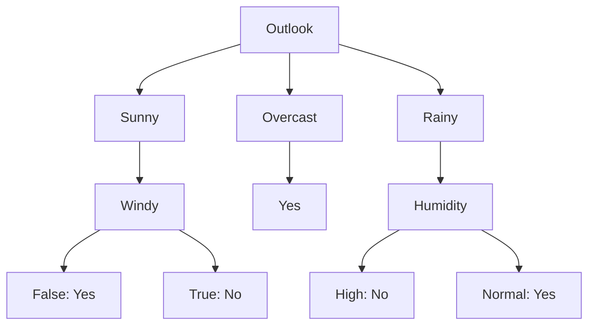

# Entropy

$$\text{Entropy(S)} = \sum_{i=1}^{c} - p_i\log_2p_i$$

$$-\frac{param(a)}{param(b)}\log_2\left(\frac{param(a)}{param(b)}\right) py(entropy = THIS)$$

Where

$p_i$ is the proportion of instances in class i, and c is the number of classes.

## Golf Play Data

| Outlook  | Temp. | Humidity | Windy | Play Golf |
| -------- | ----- | -------- | ----- | --------- |
| Rainy    | Hot   | High     | False | No        |
| Rainy    | Hot   | High     | True  | No        |
| Overcast | Hot   | High     | False | Yes       |
| Sunny    | Mild  | High     | False | Yes       |
| Sunny    | Cool  | Normal   | False | Yes       |
| Sunny    | Cool  | Normal   | True  | No        |
| Overcast | Cool  | Normal   | True  | Yes       |
| Rainy    | Mild  | High     | False | No        |
| Rainy    | Cool  | Normal   | False | Yes       |
| Sunny    | Mild  | Normal   | False | Yes       |
| Rainy    | Mild  | Normal   | True  | Yes       |
| Overcast | Mild  | High     | True  | Yes       |
| Overcast | Hot   | Normal   | False | Yes       |
| Sunny    | Mild  | High     | True  | No        |

## Play Golf Distribution

| Play Golf | Count |
| --------- | ----- |
| Yes       | 9     |
| No        | 5     |
| Total     | 14    |

### Entropy(Play Golf)

$\text{Entropy(Play Golf)} = \text{Entropy(5, 9)} = $
$py(e1 = entropy.bind(a=5, b=14); e2 = entropy.bind(a=9, b=14); ReplaceThis(str(e1) + str(e2))) py(e_pg = THIS(); ReplaceAll(THIS + ' = ' + str(e_pg)))$

## Outlook Distribution

| Outlook  | Play Golf = Yes | Play Golf = No | Total |
| -------- | --------------- | -------------- | ----- |
| Sunny    | 3               | 2              | 5     |
| Overcast | 4               | 0              | 4     |
| Rainy    | 2               | 3              | 5     |
| Total    | 9               | 5              | 14    |

### Entropy(Play Golf, Outlook)

$\text{Entropy(Play Golf, Outlook)} = \text{Prob(Sunny)*Entropy(Sunny) + Prob(Overcast)*Entropy(Overcast) + Prob(Rainy)*Entropy(Rainy)} = $
$\frac{5}{14}\left(py(ReplaceThis(str(entropy.bind(a=3, b=5)) + str(entropy.bind(a=2, b=5))))\right) + 0 + \frac{5}{14}\left(py(ReplaceThis(str(entropy.bind(a=2, b=5)) + str(entropy.bind(a=3, b=5))))\right) py(e_o = THIS(); ReplaceAll(THIS + ' = ' + str(e_o)))$

### Information Gain(Play Golf, Outlook)

$\text{IG(Play Golf, Outlook)} = \text{Entropy(Play Golf) - Entropy(Play Golf, Outlook)} =$
$py(ReplaceThis(str(e_pg) + ' - ' + str(e_o))) py(ig_o = THIS(); ReplaceThis(' = ' + str(ig_o)))$

## Temperature Distribution

| Temperature | Play Golf = Yes | Play Golf = No | Total |
| ----------- | --------------- | -------------- | ----- |
| Hot         | 2               | 2              | 4     |
| Mild        | 4               | 2              | 6     |
| Cool        | 3               | 1              | 4     |
| Total       | 9               | 5              | 14    |

### Entropy(Play Golf, Temperature)

$\text{Entropy(Play Golf, Temperature)} = \text{Prob(Hot)*Entropy(Hot) + Prob(Mild)*Entropy(Mild) + Prob(Cool)*Entropy(Cool)} =$
$\frac{4}{14}\left(py(ReplaceThis(str(entropy.bind(a=2, b=4)) + str(entropy.bind(a=2, b=4))))\right) + \frac{6}{14}\left(py(ReplaceThis(str(entropy.bind(a=4, b=6)) + str(entropy.bind(a=2, b=6))))\right) + \frac{4}{14}\left(py(ReplaceThis(str(entropy.bind(a=3, b=4)) + str(entropy.bind(a=1, b=4))))\right) py(e_t = THIS(); ReplaceAll(THIS + ' = ' + str(e_t)))$

### Information Gain(Play Golf, Temperature)

$\text{IG(Play Golf, Temperature)} = \text{Entropy(Play Golf) - Entropy(Play Golf, Temperature)} =$
$py(ReplaceThis(str(e_pg) + ' - ' + str(e_t))) py(ig_t = THIS(); ReplaceAll(THIS + ' = ' + str(ig_t)))$

## Humidity Distribution

| Humidity | Play Golf = Yes | Play Golf = No | Total |
| -------- | --------------- | -------------- | ----- |
| High     | 3               | 4              | 7     |
| Normal   | 6               | 1              | 7     |
| Total    | 9               | 5              | 14    |

### Entropy(Play Golf, Humidity)

$\text{Entropy(Play Golf, Humidity)} = \text{Prob(High)*Entropy(High) + Prob(Normal)*Entropy(Normal)} =$
$\frac{7}{14}\left(py(ReplaceThis(str(entropy.bind(a=3, b=7)) + str(entropy.bind(a=4, b=7))))\right) + \frac{7}{14}\left(py(ReplaceThis(str(entropy.bind(a=6, b=7)) + str(entropy.bind(a=1, b=7))))\right) py(e_h = THIS(); ReplaceAll(THIS + ' = ' + str(e_h)))$

### Information Gain(Play Golf, Humidity)

$\text{IG(Play Golf, Humidity)} = \text{Entropy(Play Golf) - Entropy(Play Golf, Humidity)} =$
$py(ReplaceThis(str(e_pg) + ' - ' + str(e_h))) py(ig_h = THIS(); ReplaceAll(THIS + ' = ' + str(ig_h)))$

## Windy Distribution

| Windy | Play Golf = Yes | Play Golf = No | Total |
| ----- | --------------- | -------------- | ----- |
| False | 6               | 2              | 8     |
| True  | 3               | 3              | 6     |
| Total | 9               | 5              | 14    |

### Entropy(Play Golf, Windy)

$\text{Entropy(Play Golf, Windy)} = \text{Prob(False)*Entropy(False) + Prob(True)*Entropy(True)} =$
$\frac{8}{14}\left(py(ReplaceThis(str(entropy.bind(a=6, b=8)) + str(entropy.bind(a=2, b=8))))\right) + \frac{6}{14}\left(py(ReplaceThis(str(entropy.bind(a=3, b=6)) + str(entropy.bind(a=3, b=6))))\right) py(e_w = THIS(); ReplaceAll(THIS + ' = ' + str(e_w)))$

### Information Gain(Play Golf, Windy)

$\text{IG(Play Golf, Windy)} = \text{Entropy(Play Golf) - Entropy(Play Golf, Windy)} =$
$py(ReplaceThis(str(e_pg) + ' - ' + str(e_w))) py(ig_w = THIS(); ReplaceAll(THIS + ' = ' + str(ig_w)))$

## Summary of Information Gains

| Attribute   | Information Gain        |
| ----------- | ----------------------- |
| Outlook     | $py(ReplaceThis(ig_o))$ |
| Temperature | $py(ReplaceThis(ig_t))$ |
| Humidity    | $py(ReplaceThis(ig_h))$ |
| Windy       | $py(ReplaceThis(ig_w))$ |

As we can see, the attribute with the highest information gain is **Outlook**, making it the best choice for the root node in a decision tree for this dataset. Now let's find the next best attribute for each branch of outlook.

## Sunny Branch

| Sunny | Count |
| ----- | ----- |
| Yes   | 3     |
| No    | 2     |
| Total | 5     |

### Entropy(Sunny)

$\text{Entropy(Sunny)} = \text{Entropy(3, 2)} =$
$py(ReplaceThis(str(entropy.bind(a=3, b=5)) + str(entropy.bind(a=2, b=5)))) py(e_s = THIS(); ReplaceAll(THIS + ' = ' + str(e_s)))$

## Temperature Distribution

| Temperature | Play Golf = Yes | Play Golf = No | Total |
| ----------- | --------------- | -------------- | ----- |
| Hot         | 0               | 0              | 0     |
| Mild        | 2               | 1              | 3     |
| Cool        | 1               | 1              | 2     |
| Total       | 3               | 2              | 5     |

### Entropy(Sunny, Temperature)

$\text{Entropy(Sunny, Temperature)} = \text{Prob(Hot)*Entropy(Hot) + Prob(Mild)*Entropy(Mild) + Prob(Cool)*Entropy(Cool)} =$
$0 + \frac{3}{5}\left(py(ReplaceThis(str(entropy.bind(a=2, b=3)) + str(entropy.bind(a=1, b=3))))\right) + \frac{2}{5}\left(py(ReplaceThis(str(entropy.bind(a=1, b=2)) + str(entropy.bind(a=1, b=2))))\right) py(e_ts = THIS(); ReplaceAll(THIS + ' = ' + str(e_ts)))$

### Information Gain(Sunny, Temperature)

$\text{IG(Sunny, Temperature)} = \text{Entropy(Play Golf | Outlook = Sunny) - Entropy(Sunny, Temperature)} =$
$py(ReplaceThis(str(e_s) + ' - ' + str(e_ts))) py(ig_ts = THIS(); ReplaceAll(THIS + ' = ' + str(ig_ts)))$

## Humidity Distribution

| Humidity | Play Golf = Yes | Play Golf = No | Total |
| -------- | --------------- | -------------- | ----- |
| High     | 1               | 1              | 2     |
| Normal   | 2               | 1              | 3     |
| Total    | 3               | 2              | 5     |

### Entropy(Sunny, Humidity)

$\text{Entropy(Sunny, Humidity)} = \text{Prob(High)*Entropy(High) + Prob(Normal)*Entropy(Normal)} =$
$\frac{2}{5}\left(py(ReplaceThis(str(entropy.bind(a=1, b=2)) + str(entropy.bind(a=1, b=2))))\right) + \frac{3}{5}\left(py(ReplaceThis(str(entropy.bind(a=2, b=3)) + str(entropy.bind(a=1, b=3))))\right) py(e_hs = THIS(); ReplaceAll(THIS + ' = ' + str(e_hs)))$

### Information Gain(Sunny, Humidity)

$\text{IG(Sunny, Humidity)} = \text{Entropy(Play Golf | Outlook = Sunny) - Entropy(Sunny, Humidity)} =$
$py(ReplaceThis(str(e_s) + ' - ' + str(e_hs))) py(ig_hs = THIS(); ReplaceAll(THIS + ' = ' + str(ig_hs)))$

## Windy Distribution

| Windy | Play Golf = Yes | Play Golf = No | Total |
| ----- | --------------- | -------------- | ----- |
| False | 3               | 0              | 3     |
| True  | 0               | 2              | 2     |
| Total | 3               | 2              | 5     |

### Entropy(Sunny, Windy)

$\text{Entropy(Sunny, Windy)} = \text{Prob(False)*Entropy(False) + Prob(True)*Entropy(True)} =$
$\frac{3}{5}\left(py(ReplaceThis(str(entropy.bind(a=3, b=3)) + str(entropy.bind(a=0, b=3))))\right) + \frac{2}{5}\left(py(ReplaceThis(str(entropy.bind(a=0, b=2)) + str(entropy.bind(a=2, b=2))))\right) py(e_ws = THIS(); ReplaceAll(THIS + ' = ' + str(e_ws)))$

### Information Gain(Sunny, Windy)

$\text{IG(Sunny, Windy)} = \text{Entropy(Play Golf | Outlook = Sunny) - Entropy(Sunny, Windy)} =$
$py(ReplaceThis(str(e_s) + ' - ' + str(e_ws))) py(ig_ws = THIS(); ReplaceAll(THIS + ' = ' + str(ig_ws)))$

## Summary of Information Gains for Sunny Branch

| Attribute   | Information Gain         |
| ----------- | ------------------------ |
| Temperature | $py(ReplaceThis(ig_ts))$ |
| Humidity    | $py(ReplaceThis(ig_hs))$ |
| Windy       | $py(ReplaceThis(ig_ws))$ |

As we can see, the attribute with the highest information gain for the Sunny branch is **Windy**, making it the best choice for the next node in the decision tree for this branch.

## Overcast Branch

For the Overcast branch, all instances result in "Play Golf = Yes". Therefore, no further splits are necessary, and we can directly classify this branch as "Yes".

## Rainy Branch

| Rainy | Count |
| ----- | ----- |
| Yes   | 2     |
| No    | 3     |

...

We can continue this process for the Rainy branch similarly to how we did for the Sunny branch, calculating the information gains for Temperature, Humidity, and Windy, and choosing the best attribute for the next split.

We found out **Humidity** has the highest information gain for the Rainy branch.

## Decision Tree Summary

